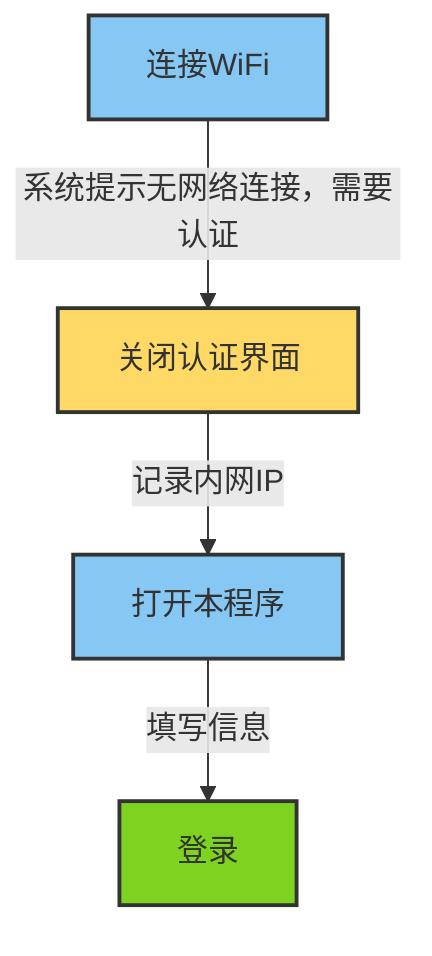

<p align="center">
  
</p>
  <h1 align="center">
  重邮校园网客户端登录
</h1>

<p align="center">
  基于 PyQt6 - Fluent Design 设计
</p>
<p align="center">
  <a style="text-decoration:none">
    
  </a>
  <a style="text-decoration:none">
    
  </a>
</p>


### 介绍

本程序基于pyqt6开发，使用pyqt6-fluent-widgets美化组件，提供重邮校园网伪装设备类型，gui登录等。


### 功能

- [x] 电脑端/移动端切换

- [x] 通过伪装，支持双电脑同时在线

- [ ] 突破坑位限制-不支持


### 流程





注意内网ip是填写在"获取本机ip"按钮之下的，而最上面的"192.168.200.2"不需要填写


### 项目结构

```
SchoolNet/
- CQUPT_Link.py  主程序
- ConnectDb.py   连接数据库程序
- account.db	 sqlite3数据库 如果没有自动生成  
- pyrcc5.exe     使用pyrcc5转换图片
- images.qrc     使用pyrcc5转换图片
- images.py      使用pyrcc5转换图片
- LoginWindow.py ui转换后的文件
- requirements.txt
- resource/      资源文件
-- images/
--- xx.jpg
-- LoginWindow.ui

```


### 自编译

如果您想自行编译源码，在导入requirements后
```
pyinstaller -w -i .\resource\images\favicon.ico CQUPT_Link.py
```


### 参考

[校园网自动登录全平台解决方案 - 知乎 (zhihu.com)](https://zhuanlan.zhihu.com/p/364016452?utm_medium=social&utm_oi=1112727310867927040&utm_id=0)


### 许可证

CQUPT_Link 使用 GPLv3 许可证.

Copyright © 2023 by dullspear

